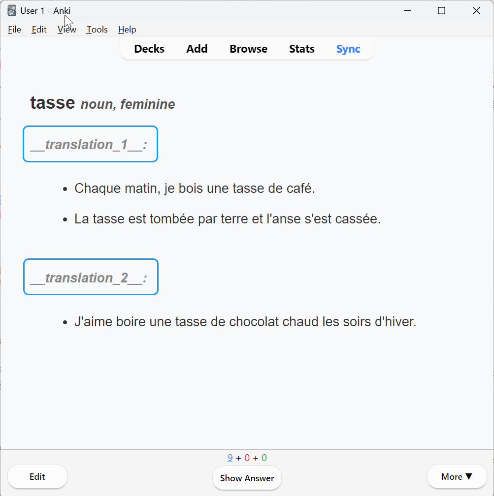
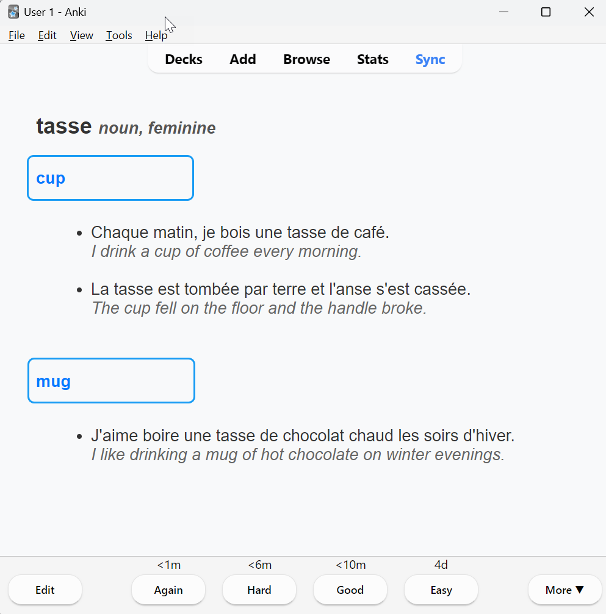
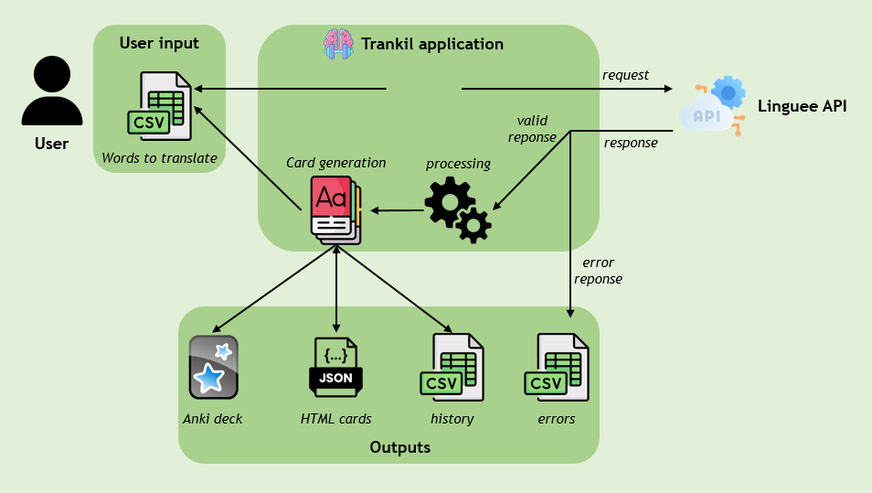
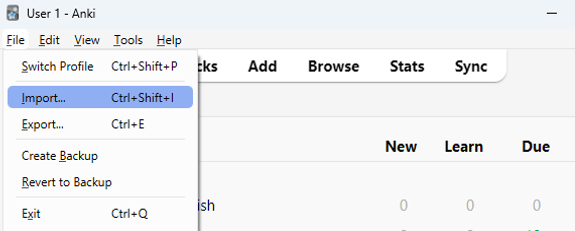

<p align="center">
  
</p>

# 🧠 Trankil

**Trankil** is a Python tool that helps you create customized multilingual **Translations** **Anki cards**.  
Its main goal is to make vocabulary acquisition _trankillement_ and effectively by generating flashcards from user input.


[](https://codecov.io/gh/USER/REPO)
[](LICENSE)

### ✨ Features

- 🔁 Fetch **translations** and example usages from external APIs (Linguee.)
- 🧠 Generate fully formatted **Anki cards** with support for:
  - Multiple translations
  - Example sentences
  - Part-of-speech tagging
- 📦 Export `.apkg` decks ready to import into Anki
- 🪶 Lightweight and configurable

<table>
  <tr>
    <td align="center">
      <br/>
      <em>Anki front card with 2 translations. <br> For each translations, several contextual phrases are displayed.</em>
    </td>
    <td align="center">
      <br/>
      <em>Anki back card with the answers. <br> Then you can assess yourself.</em>
    </td>
  </tr>
</table>

##### Supported Languages

This "Supported Languages" section is taken directly from the [Linguee API](https://github.com/imankulov/linguee-api) documentation.

>API supports all the languages, supported by Linguee. As in Linguee, not all language pairs are valid though. Supported languages: bg (Bulgarian), cs (Czech), da (Danish), de (German), el (Greek), en (English), es (Spanish), et (Estonian), fi (Finnish), fr (French), hu (Hungarian), it (Italian), ja (Japan),lt (Lithuanian), lv (Latvian), mt (Maltese), nl (Dutch), pl (Polish), pt (Portuguese), ro (Romanian), ru (Russian), sk (Slovak), sl (Solvene), sv (Swedish), zh (Chinese).

### ⚙️ Installation

**To be done**. Needs to check on another laptop the steps.

Specify which dependancies are installed based on basic installvation vs "dev" one.

### 🛠️ Configuration

```
# The application .env file
APP__SRC=fr # Replace with the code you need to build your deck
APP__DST=en # Replace with the code you need to build your deck
APP__WORDS_LIMIT=5 # Maximum number of loaded words per run to avoid blocking by the Linguee API.
```

1. Make sure you have saved your csv file containing the words to be tranlasted to this path: "data\src_dst\input_words.csv". 
2. Make sure as weel the header is "word_to_translate".

With the following .env file
```
APP__SRC=fr
APP__DST=en
APP__WORDS_LIMIT=5
```
The path to path to save your file is: "data\fr_en\input_words.csv".

### 🚀 Usage

To run the script
```
poetry run python .\trankil\main.py
```

Let me explain how **Trankil** works for you to make the most of it:

<table align="center">
    <td align="center">
      <br/>
      <em> Trankil data flow </em>
    </td>
</table>

1. The application retrieves APP__WORDS_LIMIT words to be translated
2. Requests the Lingue API the translations
3. For the valid responses, a processing step is applied to create the flashcards.
4. The cards are created based on the template presented above.
5. Those cards are merged with the load ones from the json file (from another run).
6. The **Trankil** deck is created from all those cards.
7. The deck is overrided.
8. All the cards are saved into the json file.
9. The valid responses are saved in the history file.
10. The valid responses are removed from the input file.
12. Finally the errors are written into a csv file with some hints to let the users corrects the spelling and run it again.

The deck uploading to the Anki application has to be done manually:
<table align="center">
    <td align="center">
      <br/>
      <em> Then select the deck you want to import from the output folder </em>
    </td>
</table>

__Important__: After importing you deck into the Anki application, it's important to manually delete the following 2 files:
- outputs\src_dst\Trankil.apkg
- outputs\src_dst\Trankil.json

The [genanki](https://github.com/kerrickstaley/genanki) library, to my knowledge, doesn't provide any feature to load the notes from an existing deck. That's why the json file is used to save all the existing notes locally.

You may fin the program rather slow. A sleeper in the API calls is coded with extremely safe parameters to avoid any blocking. Feel free to change those parameters.

### ✅ Tests

To run the pytest coverage and get a report run the command:
```
poetry run pytest --cov=trankil --cov-report=html .\tests
```

### 🤝 Contributing

1. Create an issue on the repo
2. Fork the repo
3. Create a bracnh linked to the issue
4. Commit and Push
5. Open a Pull Request

### 🗺️ Upcoming Features

- [ ] Build a CLI (⚙️ Simple CLI or script-based usage)
- [ ] Publish to pypi
- [ ] Deal with Interlingual homograph: A word that is spelled the same in two or more languages but has different meanings in each of them. Currently the Linguee API return both translation (from src -> dst and dts -> src) but only the src -> dst translation is expected.
- [ ] Use tox to test Trankil across multiple Python versions.
- [ ] Use pre-commit as a dev dependancy.
- [ ] For traductions that don't have examples, use the examples and external_sources endpoints.
- [ ] Add the mp3 sound functionality. Let the users choose.

### 📜 License

This project is licensed under the terms of the MIT license.